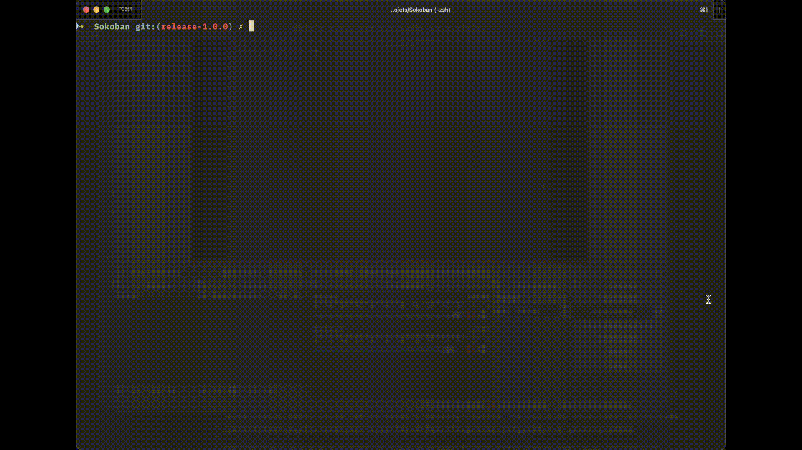
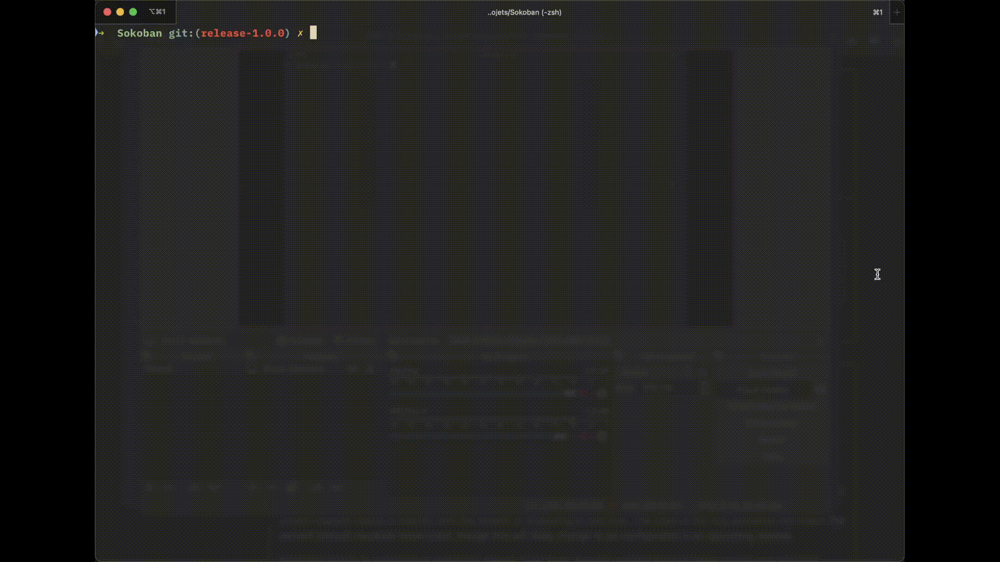

# Sokoban

<!-- Pour la compatibilité de Github et de Doxygen en même temps j'ai du utiliser cette ligne de html pour attacher une image -->
<a href="https://github.com/GreengagePlum/Sokoban/actions/workflows/test.yml"></a>
<a href="https://github.com/GreengagePlum/Sokoban/actions/workflows/deploy.yml"></a>

<a href="https://github.com/GreengagePlum/Sokoban/blob/main/README.md"></a>
<a href="https://github.com/GreengagePlum/Sokoban/blob/main/README.fr.md"></a>

Voici un projet de programmation en C que j'ai réalisé lors de la deuxième année de ma licence pour l'UE "Techniques de développement". Il s'agit d'un jeu de puzzle nommé Sokoban.

Vous trouverez ici [les fichiers de base pour](https://git.unistra.fr/techdevprintemps2022/SokobanTechDev) le TP noté concernant le jeu du Sokoban. Les consignes et l'énoncé se trouvent à cette adresse [TP Sokoban](https://techdevprintemps2022.pages.unistra.fr/TP_TechDevEnonce/)

Sokoban est un jeu vidéo de réflexion inventé au Japon. Le joueur doit ranger des caisses sur des cases cibles. Il peut se déplacer dans les quatre directions, et pousser (mais pas tirer) une seule caisse à la fois. Une fois toutes les caisses rangées (c'est parfois un vrai casse-tête), le niveau est réussi et le joueur passe au niveau suivant. ([Article Wikipédia](https://fr.wikipedia.org/wiki/Sokoban))

La documentation en ligne pour ce projet est hébergé par Github Pages et se trouve à l'adresse <https://greengageplum.github.io/sokoban/>. C'est construit automatiquement lors de chaque sortie à l'aide de Github Actions. **Attention**, la documentation est en **français** car j'ai réalisé ce projet pendant ma licence en France.

## Un aperçu

### Sokoban dans le terminal



### Sokoban GUI



Je me suis inspiré de ces dépôts git :

* [TD1 - Criblage](https://gitlab.com/qgoestch/td1-criblage)
* [doxygen-exemple-bidon](https://git.unistra.fr/max.schmitt/doxygen-exemple-bidon)
* [Generic-Makefile](https://github.com/Leandros/Generic-Makefile/blob/master/Makefile)
* [todo-md](https://github.com/todo-md/todo-md)

## Étudiants

**Efe ERKEN**

Année : L2S3 Automne 2022

Groupes : TD2-TP4

## Problèmes rencontrés

Voici vous pouvez trouver les problèmes que j'ai eu lors du développement et comment je les ai résolus (ou pas).

### Superposition joueur-objectif

Dans la première version v1.0.0 où on devait juste gérer le mouvement du joueur dans le vide et sur les objectifs, j'étais bloqué car j'arrivais pas à passer le joueur sur les objectifs. Ceci était dû au fait que mon implémentation de départ était problématique. Pour bouger le joueur dans le sens voulu, j'échangeais la case dans le sens voulu et la case où se situait le joueur. Cette méthode ne marchait bien que quand la case dans le sens voulu était vide. Si elle était un objectif, cela revenait à modifier l'emplacement de l'objectif. J'ai dû repenser mon approche.

J'ai passé à une méthode conditionnelle où en fonction des cases concernées, je modifie manuellement ces cases. J'ai dû étendre les représentations des cases dans la structure de jeu pour représenter la superposition du joueur avec un objectif. Grâce à cela, j'ai pu gérer le mouvement sans bouger les emplacements des objectifs et sans utiliser d'autres champs de données dans la structure de jeu pour stocker les positions de chaque objectif.

### Affichage `ncurses`

À partir des version 0.2.0 de mon programme, j'ai intégré l'affichage à la ligne de commande qui utilise la bibliothèque `ncurses` au lieu des fonctions `printf` et `scanf` de la bibliothèque `stdio`. Avant ce changement mon programme n'avait aucune fuite mémoire ou erreur mémoire après vérification `valgrind`.

J'étais surpris par le nombre de fuites après la nouvelle implémentation d'affichage qui était un changement relativement petit. J'ai appris par après que ces fuites n'étaient pas à cause de mon code à moi mais à cause de la bibliothèque `ncurses`. Cette bibliothèque n'a pas de fuite mémoire d'un point de vue mémoire inaccessible mais c'est des `free` non faits, du coup la mémoire reste toujours accessible.

Finalement, il n'y a aucune fuite ou erreur mémoire due à mon code. Elles sont extérieures à moi. Dans le sujet de TP, il est dit d'éviter les fuites et erreurs dû à notre code mais pas dû aux bibliothèques externes utilisées. Ceci ne doit pas poser problème.

Au cas où, la série de versions 0.1.0 utilisent une méthode d'affichage sans la bibliothèque `ncurses`, du coup elles peuvent être considérées 100% pures.

### Fonction `event()` avec `fgetc()`

J'ai du trouver une solution pour vider le buffer avant ou après l'appel à fgetc() pour récupérer une touche au clavier car sinon chaque appui sur la touche entrée causait la fonction event() à renvoyer EVENT_NONE qui causait des affichages en plus inutiles.

## Versions gcc/clang

J'ai utilisé comme compilateur "GNU gcc" et "Apple clang". J'ai utilisé `gcc` lorsque je travaillais sur les machines de l'UFR et lorsque je travaillais depuis chez moi, j'ai utilisé `clang`.

J'ai fait attention à tester mon programme sur les machines de l'UFR pour vérifier les erreurs avant de rendre sur Moodle.

Ci-dessous sont les versions des compilateurs que j'ai utilisées.

```text
gcc (Ubuntu 9.4.0-1ubuntu1~20.04.1) 9.4.0

gcc-12 (Homebrew GCC 12.2.0) 12.2.0

Apple clang version 14.0.0 (clang-1400.0.29.102)

Apple clang version 14.0.0 (clang-1400.0.29.202)
```

## Utilisation

### Comment compiler et exécuter ?

D'abord installez les dépendances avec votre gestionnaire de paquets (apt, dnf, apk, brew, etc.) : `gcc` (GNU C toolchain), `make`, `libsdl2`, `libsdl2-dev` (pour la compilation), `libncurses`, `libncurses-dev` (pour la compilation).

Puis téléchargez le projet sur votre machine avec une des commandes qui suivent :

```sh
git clone https://github.com/GreengagePlum/Sokoban.git
```

ou

```sh
git clone git@github.com:GreengagePlum/Sokoban.git
```

Une fois cela est fait, rendez-vous dans le répertoire du projet et compilez.

```sh
cd sokoban/

make
```

Désormais vous pouvez exécuter le jeu tant que vous etes dans le répertoire de celui-ci.

```sh
./sokoban --console
```

ou

```sh
./sokoban --sdl2
```

### Génération de la documentation

D'abord installez les dépendances avec votre gestionnaire de paquets (apt, dnf, apk, brew, etc.) : `doxygen`, `graphviz`.

Pour générer la documentation pour votre copie du programme, utilisez la commande suivante et jeter un oeil au fichier `doc/public/index.html` dans votre navigateur de web préféré.

```sh
make doc
```

Ou bien, vous pouvez visualiser la [documentation en ligne](https://greengageplum.github.io/sokoban/) de la dernière version.

### Génération d'une archive redistribuable

Pour archiver le projet avec tous les fichiers nécessaires pour compiler et générer la documentation dans un format `tar.gz` pour redistribuer, utilisez la commande suivante :

```sh
make archive
```

### Comment nettoyer ?

Pour nettoyer le répertoire du projet pour repartir à zéro il existe plusieurs commandes utiles.

Effacer les fichiers de compilation (`*.o`, `*.d`, exécutable final). Cela est à faire surtout si vous changez les options de `gcc` (comme ajouter `-g` pour déboguer) ou si vous passez à l'exécutable test avec la commande `make test`.

```sh
make clean
```

Effacer la documentation et ses répertoires

```sh
make cleandoc
```

Effacer l'archive

```sh
make cleanarchive
```

Cela est une commande qui regroupe toutes celles qui viennent avant. Elle efface tous les fichiers et répertoires de compilation, de documentation et d'archives.

```sh
make cleanall
```

### Environnement de développement

Pour avoir un environnement de développement pour ce projet pour développer en local ou bien pour faire des contributions, suivez les instructions auparavant pour récuperer le code source et installer les dépendances.

Ensuite, vous pouvez si vous choisissez, configurer les tests pour pouvoir les effectuer en local et aussi pour avoir un avis sur comment serait le resultat des tests sur le serveur effectué en CI/CD.

Pour ce faire, installez `python` (version 3) et [`pre-commit`](https://pre-commit.com/).

Une fois vous avez `python`,

```sh
python -m venv .venv                            # Je conseille de creer un environnment virtuel avec votre méthode préférée
source .venv/bin/activate                       # Activer l'environnement virtuel
pip install --upgrade pip                       # Mettre à jour pip
pip install pre-commit                          # Installer pre-commit
pre-commit install -t pre-commit -t pre-push    # Configurer les git hooks
pre-commit run -a --hook-stage pre-push         # Effectuer tous les tests pour une premère fois
```

## Comment jouer ?

Utilisez les touches 'h', 'j', 'k', 'l' pour vous déplacer (ou aussi les touches fléchées si vous êtes en mode `--sdl2`).

Appuyez sur 'q' pour quitter le jeu.

Poussez les boites sur les multiples cibles dans le niveau. Une fois toutes les cibles sont couvertes vous gagnez. Vous ne pouvez pas tirer les boites et vous ne pouvez pas pousser deux ou plus de boites en même temps.

## Licence

Ce projet est sous la licence "GPLv3 ou toute version ultérieure".

## Dépôt Git

Le dépôt git de [ce projet](https://greengageplum.github.io/sokoban/) suit une structure claire et déterminée
proposée par Vincent Driessen à son
poste "[A successful Git branching model](https://nvie.com/posts/a-successful-git-branching-model/)".

Du coup ne soyez pas surpris par le fait que `branch main` n'a presque pas de commit. Tout le développement se passe sur
le `branch develop`. Avant chaque version, tout est préparé et assuré fonctionnel pour être inauguré au `branch main`
qui n'a que des versions stables et complètes.

### Légende emoji

La signification des emojis utilisé dans les descriptions des commits git. À voir
aussi : [gitmoji](https://gitmoji.dev/).

| Emoji              | Signification                                                         |
|:-------------------|:----------------------------------------------------------------------|
| :sparkles: NEW     | Nouveau fichier ou fonctionnalité                                     |
| :wrench: UPDATE    | Mise à jour d'une partie de programme                                 |
| :hammer: CONFIG    | Manipulation des fichiers de configuration comme makefile ou doxyfile |
| :recycle: REFACTOR | Réécriture d'une partie du programme                                  |
| :bug: BUGFIX       | Une correction de bogue                                               |
| :fire: DELETION    | Suppression d'un fichier ou d'une fonctionnalité                      |
| :memo: DOC         | Manipulation de la documentation                                      |
| :tada: EPOCH       | Le début du projet                                                    |
| :rocket: RELEASE   | Une nouvelle version du programme                                     |
