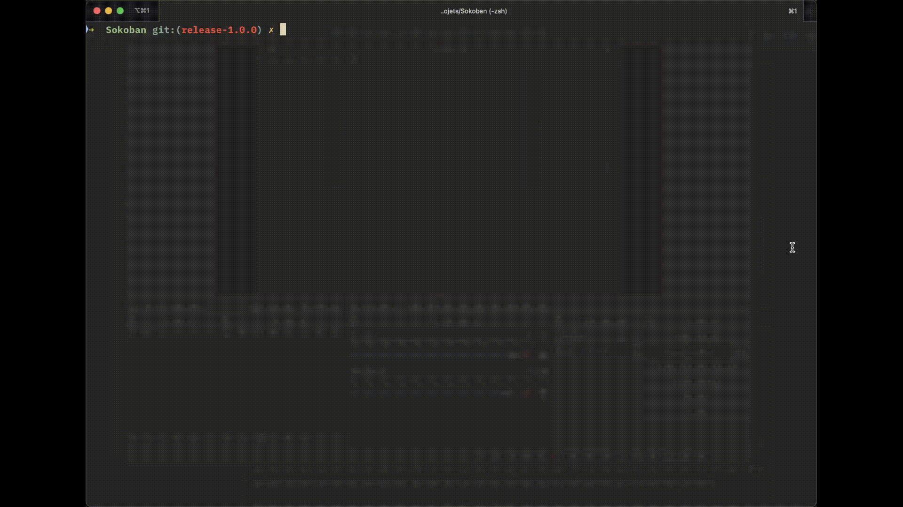

# Sokoban

<!-- For the compatibility of Github and Doxygen at the same time I had to use this line of html to attach an image -->
<a href="https://github.com/GreengagePlum/Sokoban/actions/workflows/test.yml"></a>
<a href="https://github.com/GreengagePlum/Sokoban/actions/workflows/deploy.yml"></a>

<a href="https://github.com/GreengagePlum/Sokoban/blob/main/README.md"></a>
<a href="https://github.com/GreengagePlum/Sokoban/blob/main/README.fr.md"></a>

Here is a programming project in C that I've carried out during the second year of my bachelor's degree for the "Development techniques" class. It is a puzzle game named Sokoban.

You'll find here [the base files for](https://git.unistra.fr/techdevprintemps2022/SokobanTechDev) the project concerning the game of Sokoban. The instructions are to be found at this address [TP Sokoban](https://techdevprintemps2022.pages.unistra.fr/TP_TechDevEnonce/)

Sokoban is a puzzle video game invented in Japan. The player has to move the crates to the target spots. The player can move in the four directions and push (but not pull) a single crate at a time. Once all the crates are put away (it's sometimes a real headache), the level is complete and the player moves on to the next level. ([Wikipedia article](https://en.wikipedia.org/wiki/Sokoban))

The online documentation for this project is hosted by Github Pages and is found at this address <https://greengageplum.github.io/Sokoban/>. It is automatically built during each release using Github Actions. **Attention**, the documentation is in **French** since I carried out this project during my bachelor's in France.

## A preview

### Sokoban in the terminal


### Sokoban GUI



I was inspired by these git repos:

* [TD1 - Criblage](https://gitlab.com/qgoestch/td1-criblage)
* [doxygen-exemple-bidon](https://git.unistra.fr/max.schmitt/doxygen-exemple-bidon)
* [Generic-Makefile](https://github.com/Leandros/Generic-Makefile/blob/master/Makefile)
* [todo-md](https://github.com/todo-md/todo-md)

## Students

**Efe ERKEN**

Year: 2nd year 3rd semester Autumn 2022

Groups: TD2-TP4

## gcc/clang versions

I used "GNU gcc" et "Apple clang" as compilers. I used `gcc` while I was working on the machines of the faculty and while I was working from home, I used `clang`.

I paid attention to test my program on the machines of the faculty to check for errors before turning in on Moodle.

Right below are the versions of the compilers that I used.

```text
gcc (Ubuntu 9.4.0-1ubuntu1~20.04.1) 9.4.0

gcc-12 (Homebrew GCC 12.2.0) 12.2.0

Apple clang version 14.0.0 (clang-1400.0.29.102)

Apple clang version 14.0.0 (clang-1400.0.29.202)
```

## Usage

### How to compile and execute?

First, install the dependencies with your package manager (apt, dnf, apk, brew, etc.): `gcc` (GNU C toolchain), `make`, `libsdl2`, `libsdl2-dev` (for the compilation), `libncurses`, `libncurses-dev` (for the compilation).

Then download the project on your machine with one of the following commands:

```sh
git clone https://github.com/GreengagePlum/Sokoban.git
```

or

```sh
git clone git@github.com:GreengagePlum/Sokoban.git
```

Once that's done, go to the project directory and compile.

```sh
cd sokoban/

make
```

From now on you can execute the game so long as you're in its directory.

```sh
./sokoban --console
```

or

```sh
./sokoban --sdl2
```

### Generate the documentation

First, install the dependencies with your package manager (apt, dnf, apk, brew, etc.): `doxygen`, `graphviz`.

To generate the documentation for your copy of the program, use the following command and take a look at the file `doc/public/index.html` in your favorite web browser.

```sh
make doc
```

Or else, you could see the [online documentation](https://greengageplum.github.io/Sokoban/) for the latest version.

### Generate a redistributable archive

To archive the project with all the necessary files to compile and generate the documentation in a `tar.gz` format for redistribution, use the following command:

```
make archive
```

### How to clean?

To clean the project directory to start from zero there are multiple useful commands.

Remove all compilation files (`*.o`, `*.d`, final executable). This is to be done especially if you're changing the options of `gcc` (like adding `-g` for debugging) or if you're switching to the test executable with the command `make test`.

```sh
make clean
```

Remove the documentation and its directories

```sh
make cleandoc
```

Remove the archive

```sh
make cleanarchive
```

This is a command that groups together all that came before. It removes all the compilation, documentation and archive files and directories.

```sh
make cleanall
```

### Development environment

To have a developer environment for this projet to develop locally or to make contributions, follow the past instructions to get the source code and install the dependencies.

Ensuite, vous pouvez si vous choisissez, configurer les tests pour pouvoir les effectuer en local et aussi pour avoir un avis sur comment serait le resultat des tests sur le serveur effectué en CI/CD.

Next, you can if you wish, configure the tests to be able to run them locally and also, to have an idea on how the results of the tests on the server done by CI/CD would be.

To do this, install `python` (version 3) and [`pre-commit`](https://pre-commit.com/).

Once you have `python`,

```sh
python -m venv .venv                            # I advise you to create a virtual environment with your favorite method
source .venv/bin/activate                       # Activate the virtual environment
pip install --upgrade pip                       # Upgrade pip
pip install pre-commit                          # Install pre-commit
pre-commit install -t pre-commit -t pre-push    # Configure the git hooks
pre-commit run -a --hook-stage pre-push         # Run all the tests for the first time
```

## How to play?

Use the 'h', 'j', 'k', 'l' keys to move (or you can also use the arrow keys if you're in `--sdl2` mode).

Press 'q' to quit the game.

Poussez les boites sur les multiples cibles dans le niveau. Une fois toutes les cibles sont couvertes vous gagnez. Vous ne pouvez pas tirer les boites et vous ne pouvez pas pousser deux ou plus de boites en même temps.

Push the crates over the multiple targets in the level. Once all the targets are covered, you win. You cannot pull the crates and neither can you push two or more crates at the same time.

## License

This project is under the "GPLv3 or later" license.

## Git repository

The git repository of [this project](https://greengageplum.github.io/sokoban/) follows a clear and determined
structure put forth by Vincent Driessen in his
post "[A successful Git branching model](https://nvie.com/posts/a-successful-git-branching-model/)".

So don't be surprised by the fact that the `main branch` has few commits. All the development is happening on
the `develop branch`. Before each version, everything is prepared and guaranteed functional to be merged
into `main branch` which only has stable and complete versions.

### Emoji legend

These are the meanings of the emojis used in the git commit messages. See [gitmoji](https://gitmoji.dev/) also.

| Emoji              | Meaning                                            |
|:-------------------|:---------------------------------------------------|
| :sparkles: NEW     | New file or feature                                |
| :wrench: UPDATE    | Update of a part of the program                    |
| :hammer: CONFIG    | Changes in config files like makefile and doxyfile |
| :recycle: REFACTOR | Rewrite of a part of the program                   |
| :bug: BUGFIX       | A bug fix                                          |
| :fire: DELETION    | Removal of a file or a feature                     |
| :memo: DOC         | Changes in the documentation                       |
| :tada: EPOCH       | The beginning of the project                       |
| :rocket: RELEASE   | A new version of the program                       |
